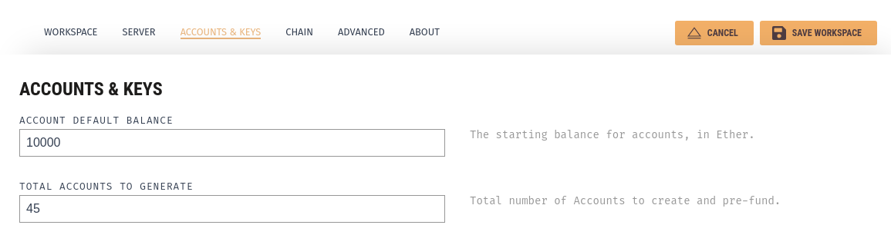
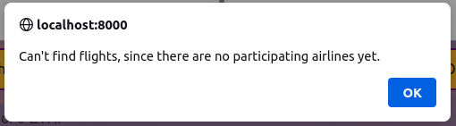
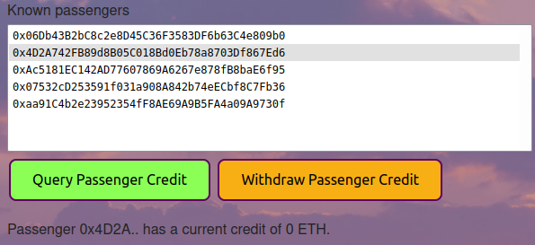

# FlightSurety

FlightSurety is a sample application project for Udacity's Blockchain course.


# Instructions

## Libary versions

Truffle and its related libraries:
```
$ truffle version
Truffle v5.5.4 (core: 5.5.4)
Ganache v^7.0.3
Solidity - ^0.8.0 (solc-js)
Node v16.14.0
Web3.js v1.5.3
```

Npm packages (note there's a different web3 version here.)
```
$ npm ls -g
...nvm/versions/node/v16.14.0/lib
├── corepack@0.10.0
├── npm@8.3.1
└── truffle@5.5.4

$ npm ls 
flightsurety@1.0.0
├── @babel/cli@7.17.6
├── @babel/core@7.17.5
├── @babel/plugin-proposal-class-properties@7.16.7
├── @babel/plugin-proposal-object-rest-spread@7.17.3
├── @babel/preset-env@7.16.11
├── babel-core@6.26.3
├── babel-loader@8.0.5
├── babel-polyfill@6.26.0
├── babel-preset-es2015@6.24.1
├── babel-preset-stage-0@6.24.1
├── bignumber.js@8.0.2
├── css-loader@1.0.1
├── express@4.16.4
├── file-loader@3.0.1
├── html-loader@0.5.5
├── html-webpack-plugin@3.2.0
├── openzeppelin-solidity@4.5.0
├── start-server-webpack-plugin@2.2.5
├── style-loader@0.23.1
├── superstatic@6.0.3
├── truffle-assertions@0.9.2
├── web3@1.7.1
├── webpack-cli@3.3.12
├── webpack-dev-server@3.7.1
├── webpack-node-externals@1.7.2
└── webpack@4.46.0
```

```
Ganache Desktop App v2.5.4
```

## 1. Setting up Ganache

* Make sure that you have at least 45 accounts (1 owner, 5 airlines, 5 passengers, 30 oracles. Oracles start at 15, thus the 45 requirement.)
* Configure a high balance for the accounts if desired.
  * Airlines need at least 10 eth, oracles 1 eth, and passengers some eth to buy insurance. 
  * If you plan on running tests, accounts at the top will consume more eth.
  * I would recommend setting 10000 eth just to avoid problems.

<p align="center"></p>

## 2. Migrate contracts

```
$ truffle migrate --reset
```

You can also run all the implemented tests:
```
$ truffle test
Using network 'development'.
...

  12 passing (18s)

```

## 3. Start dapp and server

**DAPP:**
```
$ npm run dapp

> flightsurety@1.0.0 dapp
> webpack-dev-server --mode development --config webpack.config.dapp.js

ℹ ｢wds｣: Project is running at http://localhost:8000/
...
```

**SERVER:**
```
$ npm run server

> flightsurety@1.0.0 server
...
All indexes have at least 3 oracles. Server is ready for oracle requests!
```

# Interacting with the DAPP

The design of the Dapp serves several purposes:
<ol type="a">
  <li>Mock UI for passengers</li>
  <li>Mock UI for airlines</li>
  <li>Debugging tools for developer</li>
  <li>Showcase blockchain integration</li>
</ol>

A proper Dapp UI dedicated to passengers only (as end user) would have different UX elements, following better design practices and implementation.

---

The DAPP is thus divided in 3 sections:

    1. Passenger: Controls related to how a passenger would use the Dapp.
    2. Oracles: Minimal UI elements to verify status of oracle requests (can also be done in the server).
    3. Airlines: Controls for airline registration, and to pay participating fee.

1. 
2. 
3. 

---

**TIPS**:
* Green buttons are reading or non-blockchain operations
* Orange buttons are writing operations
* Browser alerts are fired for operation errors, for example:

| A UI element requires selection: | An operation failed: |
|-----|-----|
|||


<p align="center"></p>

# Recommended tests for functionality

## 1. Pay airline fee to have a participating airline

1. Select airline from "Registered Airlines" list
2. Click "Pay Participating Fee" button
<p align="center"></p>

Now the participating airline can register other airlines, including voting for the 5th one.
The number within parethensis in the "Candidate Airlines" list reflects the number of votes.
<p align="center"></p>

## 2. Insure a passenger on a flight

Now we can generate some flights for the passenger, clicking "Get Available Flights".

<p align="center"></p>

Next we can:

1. select available flight
2. input amount to insure (in ether)
3. select the passenger to insure
4. click on "Insure Passenger on Flight" button

This will purchase insurance for the passenger, which gets registered in the lists (*insured flights per passenger* and *insured flights*)

<p align="center"></p>

These steps can be repeated to purchase more insurance for different flights, amounts or passengers.

<p align="center"></p>

## 3. Fetch status of the flight

Now we can fetch the flight status for an insured flight, by selecting it, and then clicking the "Fetch Flight Status (Submit to Oracles)" button.

<p align="center"></p>

This will submit the request to the oracles, which will be reflected by showing an open request in the oracle requests section.

<p align="center"></p>

You can now check the logs for the server, which should display the incoming request, along with the status code responses from the oracles. The request will be closed as soon as consesus is achieved:

```
==> Oracle Request is OPEN 0xbcf576d008a3d1EEb0fAeBD801F09A5Cd70B7e8E 803 1647298249000 3
 | - 0xEc69..0xEc698F4c923A6b030f3c7F0fa2Fdcc7c869Fa968 response ACCEPTED for status code 30.
 | - 0xAe86..0xAe86723fC4EA042b56b00dd32d85Df7680dfC354 response ACCEPTED for status code 40.
 | - 0x5f2C..0x5f2CE167Bd5FBadFA45F4530a6CC5501a98c15e7 response ACCEPTED for status code 50.
 | - 0xe35e..0xe35eC9D31ae7052Ac1A62bd1aB9920d40CBEC2f6 response ACCEPTED for status code 50.
 | - 0x3178..0x31789A452662470293451A66db253883f2436558 response ACCEPTED for status code 20.
 | - 0x58f8..0x58f883663d4BBd3a5EeDaFa06957CC49f4285378 response ACCEPTED for status code 20.
 | - 0xb293..0xb293A3eadA07b5Cb2C6C85beAf1242efd0600a25 response ACCEPTED for status code 50.
 | - 0xB5f3..0xB5f3f014c4f2f404F525Df87C375e6C1e85dF2F3 response REJECTED: Returned error: VM Exception while processing transaction: revert This oracle request is not open.
 | - 0xB8db..0xB8db34cf36D8C3A7C3ADc4737daFE61F593b7f6f response REJECTED: Returned error: VM Exception while processing transaction: revert This oracle request is not open.
 | - 0x46b3..0x46b362aB18BAEcafbf0592E6A3AEc7FC1840AAC8 response REJECTED: Returned error: VM Exception while processing transaction: revert This oracle request is not open.
```

You can now manually "Refresh Oracle Requests", which will update the status for the request, including the recorded flight status:

<p align="center"></p>

Note that attempting to fetch the status for a flight yield an error, since the flight status is already resolved:

<p align="center"></p>


## 4. Repeat (1-3) until a status code of 20 is achieved (which has payouts)

In order to test passenger credit and withdrawals we need a code 20 (airline delay). The current server implementation favors code 20, but others are still possible. I suggest repeating the steps until you achieve a code 20:

1. Select flight, amount and passenger to insure, and click "Insure Passenger on Flight"
2. Select insured flight and click "Fetch Flight Status (Submit to Oracles)
3. After the open request appears on the list, click "Refresh Oracle Requests"

<p align="center"></p>

## 5. Check passenger credit and withdraw it

Now that we have a code 20 we can verify the credits and withdraw the credit to a passenger's account.
This can be done by clicking on "Query Passenger Credit" and "Withdraw Passenger Credit" buttons for a given passenger.

Remember you can check the amount each passenger insured on which flight in the "Insured Flights Per Passenger" list:

<p align="center"></p>

Since the code 20 was received for the flight in which passengers `0x06Db...` and `0x4D2A` had `1 eth` and `0.7 eth` respectively, we can verify that their credits match 1.5x the insured amount:

<p align="center"> </p>

If any passenger decides to withdraw their credit (by clicking the "Withdraw Passenger Credit" button), their account will be credit for that amount (it can be verified in Ganache), and their credit will be reset to 0:

<p align="center"></p>

## 6. Test your own combinations

There are more combinations of actions, but this should cover all of the major functionality.
Feel free to keep working with it!
