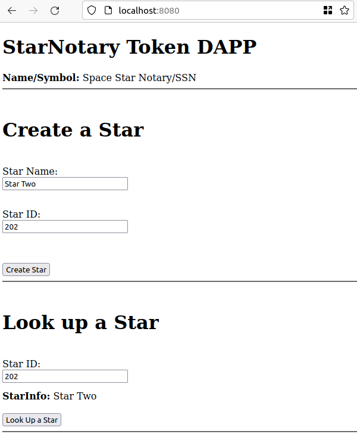
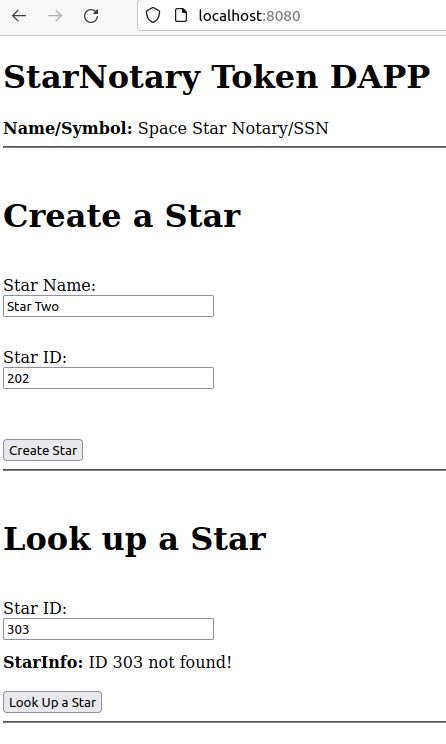

# Project 2 Star Notary Service. Submission 1

1) Your ERC-721 Token Name

`Space Star Notary`

2) Your ERC-721 Token Symbol


`SSN`

3) Version of the Truffle and OpenZeppelin used

```
$ nvm -v
0.39.1

$ npm -v
8.1.2

$ node -v
v16.13.2

$ truffle -v
Truffle v5.4.31 - a development framework for Ethereum

$ npm ls | grep truffle
├── truffle-hdwallet-provider@1.0.17 extraneous

$ npm ls | grep openzeppelin
├── openzeppelin-solidity@2.3.0 extraneous

$ npm ls | grep web3@
├── web3@1.2.1 extraneous
```

4) Your Token Address on the Rinkeby Network

- contract https://rinkeby.etherscan.io/address/0x8d93d4b35fe5d5a8819de317bfc13df8978b144b

---

# Dapp frontend 
- Note Symbol and Token are shown in the frontend when the App finishes the startup:
```
  App.start().then( x => {
    App.getNaS().then( nas => 
      {
        const nas_element = document.getElementById("name_and_symbol");
        nas_element.innerHTML = nas;
      })
  });
```
- Note a lookup search can retrieve a result (first screenshot) or show a failure (second screenshot)

*Successful lookup:* 



*Failed lookup:* 


