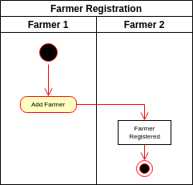
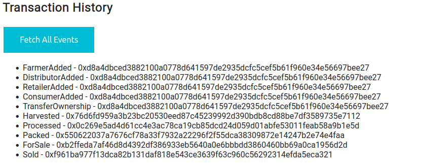

# Ethereum Dapp for Tracking Items through Supply Chain

This project consists of a DApp that allows certain users to register and verify products in a supply chain environment.

We have the following users (aka roles), along with their allowed actions:

| User/Role    | Actions   |
|--------------|-----------|
| Farmer       | Harvest Items<br>Process Items<br>Pack Items<br>Set Items for Sale |
| Distributor  | Buy Items<br>Ship Items |
| Retailer     | Receive Items |
| Consumer     | Purchase Items |

* Additionally, any user can fetch the information for a product, given the product's UPC, which acts as a unique identifier.

* The system also allows adding/renouncing permissions for ethereum accounts.

# Project UML Design

We are going to focus the UML design in what we call *Product Ownership*. Product Ownership refers to the potential change in ownership and other internal states for products in the system. This is the main functionality of the system, which allows any user to track the states and the ownership of a product they are interested in.

## Activity Diagram : Product Ownership


## Sequence Diagram : Product Ownership


## State Diagram : Product Ownership


## Class Diagram / Data Model : Product Ownership


## Role Registration / Deregistration

Note that there are other features in the system that could also be modelled in UML. I believe this is beyond the scope of this project, but it is added here to illustrate that the system is more complex than Product Ownership.

 


# Libraries

* The only libraries used are:
```
├── lite-server@2.4.0                   # to run the dapp frontend
└── truffle-hdwallet-provider@1.0.17    # to allow truffle to connect to rinkeby test network
```

* Other versions:
```
$ truffle version
Truffle v4.1.14 (core: 4.1.14)
Solidity v0.4.24 (solc-js)

$ node -v
v16.14.0

$ npm -v
8.3.1
```

* Web3: see [./project-6/src/js/web3.min.js](./project-6/src/js/web3.min.js).

* IPFS: IPFS is not used in this project.


# Frontend

The frontend has 4 sections:

* Data Fetch Form: This is a form where the user can query for the data stored in the blockchain for a given item, providing its UPC.
* Role Verification Form: This is a form where the user can query which roles/permissions are available to the current account.
* Action Form: This is a form where the user can attempt to perform an action, according to the roles and actions as described in the introduction.
* Transaction History: Button to query the events available in the contract.

## Data Fetch Form


## Role Verification Form


## Action Form


## Transaction History




# Rinkeby Test Network

The contract is currently deployed and working in the Rinkeby test network:
* Contract at [0x0a201eadb0e37cb4d8248d30a5a2b65ee1d6201d](https://rinkeby.etherscan.io/address/0x0a201eadb0e37cb4d8248d30a5a2b65ee1d6201d)
* Created in transaction [0xd8a4dbced3882100a0778d641597de2935dcfc5cef5b61f960e34e56697bee27](https://rinkeby.etherscan.io/tx/0xd8a4dbced3882100a0778d641597de2935dcfc5cef5b61f960e34e56697bee27)

Along with some transactions performed on the contract itself, up to a distributor buying the item from the farmer:
```
0xf961ba977f13dca82b131daf818e543ce3639f63c960c56292314efda5eca321	Buy Item
0xb2ffeda7af46d8d4392df386933eb5640a0e6bbbdd3860460bb69a0ca1956d2d	Sell Item
0x550622037a7676cf78a33f7932a22296f2f55dca38309872e14247b2e74e4faa	Pack Item
0x0c269e5ad4d61cc4e3ac78ca19cb85dcd24d059d01abfe53011feab58a9b1e5d	Process Item
0x76d6fd959a3b23bc20530eed87c45239992d390bdb8cd88be7df3589735e7112	Harvest Item
0xd8a4dbced3882100a0778d641597de2935dcfc5cef5b61f960e34e56697bee27	Contract Creation
```

# UnitTests

All tests are properly implemented and pass:

```
$ truffle test
Using network 'development'.

ganache-cli accounts used here...
Contract Owner: accounts[0]  0xc32...
Farmer: accounts[1]  0xbae...
Distributor: accounts[2]  0xab7...
Retailer: accounts[3]  0x262...
Consumer: accounts[4]  0x37b...

  Contract: SupplyChain
    ✓ Testing smart contract function harvestItem() that allows a farmer to harvest coffee (151ms)
    ✓ Testing smart contract function processItem() that allows a farmer to process coffee (209ms)
    ✓ Testing smart contract function packItem() that allows a farmer to pack coffee (114ms)
    ✓ Testing smart contract function sellItem() that allows a farmer to sell coffee (111ms)
    ✓ Testing smart contract function buyItem() that allows a distributor to buy coffee (398ms)
    ✓ Testing smart contract function shipItem() that allows a distributor to ship coffee (84ms)
    ✓ Testing smart contract function receiveItem() that allows a retailer to mark coffee received (143ms)
    ✓ Testing smart contract function purchaseItem() that allows a consumer to purchase coffee (149ms)
    ✓ Testing smart contract function fetchItemBufferOne() that allows anyone to fetch item details from blockchain
    ✓ Testing smart contract function fetchItemBufferTwo() that allows anyone to fetch item details from blockchain


  10 passing (1s)
```